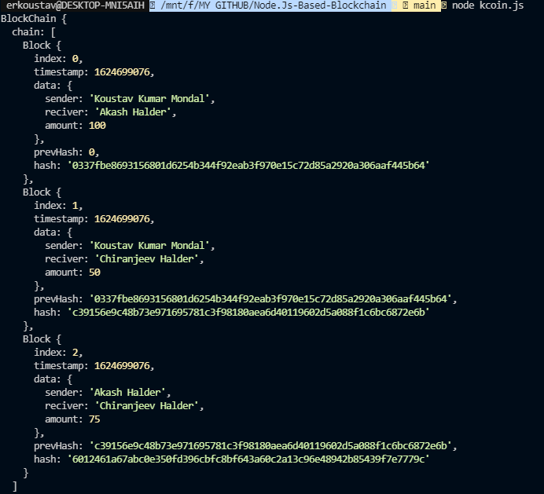

# Node.Js Based Blockchain
## This is a simple blockchain based on Node.Js

A blockchain is only a chain of blocks, a record collection, and every record is connected to other blocks. The blocks are digital data recorded in the database.

A Block can store:
* __Transaction records.__
* __An index or something that distinguishes it from other records.__
* __Participants of transactions.__

In this project i build a simple blockchain using node.js where each block contains following things:
* __Index__
* __Timestamp__
* __Data__
* __Previous hash__
* __Block hash__

And each block will be connected with another block using that block’s hash. Blocks will be protected by cryptographic encryption.

Even i made a function for validation of Blockchain that information of any block changed or not.

## Prerequisite for Running the code
* __Node.Js__
* __NPM__
* __Any type of text editor for editing the code__

## Method of Running the code

At first you have to install dependencies using this command:
```npm install```. This commands install the dependencies which are listed on __package.json__ file.

Now you are ready for run the code. Now open a terminal in project folder and run this command:```node kcoin.js```

After running the command you can see already created blocks like below image.



### by editing the __kcoin.js__ file you can create your own data blocks using described method mention below:

To create a object of a __Blockchain__ use this code.

```const BCoin = new BlockChain();```

And for creation of a block with data use below example:

```BChain.addBlock({sender: "Koustav Kumar Mondal", reciver: "Akash Halder", amount: 100});```

_When you run the code you can see the validation of blockchain is true but if you change the data then validation will be false._

